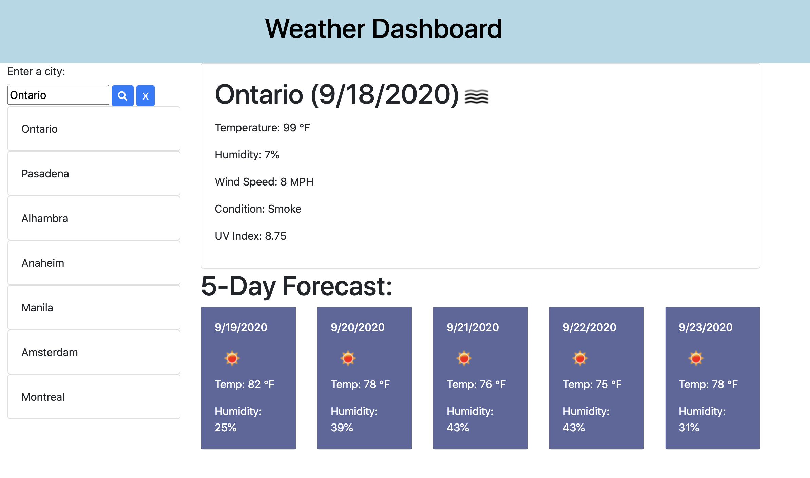

# Weather Dashboard

## Project Description

My assignment was to create a weather dashboard utilizing the OpenWeather API.  This included features such as user input, viewing specific weather details regarding what city was searched for (i.e. weather conditions, temperature, humidity, wind speed, and the UV index).

### My Process/Steps

My first step was to set up a container that includes sections for user input, current day weather information for an entered city, as well as the 5-day forecast.

Next, I worked on the JavaScript to create API requests and set up variables for my API key from OpenWeather.  Next, I entered code to display the main weather, the UV index, and the 5-day forecast.  To pull information for the UV index, I created a separate code to get the API and created variables for the longitude/latitude that became part of the URL.  Next, I used localStorage to store any previously entered cities and displayed them on the left of the page.  Afterwards, I created code to clear the currently displayed 5-day forecast to make way for a newly entered city.

Lastly, I created styling for the page and made it screen-responsnive for mobile devices.

## Website Link
https://edonohue8.github.io/weather-dashboard/

## Screenshot of Website Page

* **index**

## Author

* **Eric Donohue**
